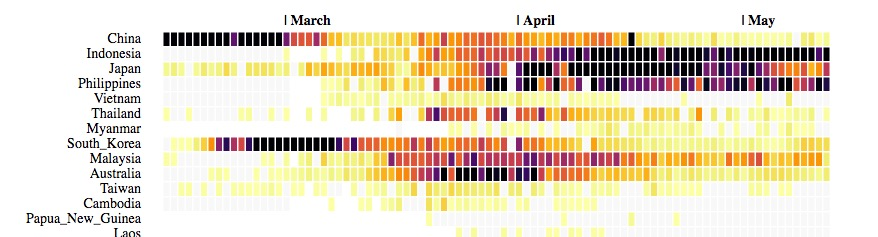

# Covid 19 World Dashboard

Graph made in `d3.js` to follow day by day the evolution of cases and deaths linked to covid19 for the main countries of the world. Countries are ranked according to their continent and the size of their population.

See the evolutive version [here][1].

Data are from the [European CDC][2].

It should be possible to use [vega-lite][3] to make this type of graph.

[1]: https://bl.ocks.org/wolfromm/992e136e174120721d5d727e7e2e9440
[2]: https://www.ecdc.europa.eu/en/publications-data/download-todays-data-geographic-distribution-covid-19-cases-worldwide
[3]: https://vega.github.io/vega-lite/examples/rect_binned_heatmap.html
